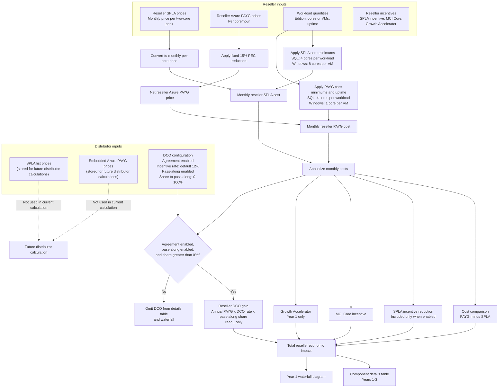

# Reseller Calculation Flow

```mermaid
flowchart TD
    subgraph Distributor["Distributor inputs"]
        D_SPLA["SPLA list prices<br/>(stored for future distributor calculations)"]
        D_AZURE["Embedded Azure PAYG prices<br/>(stored for future distributor calculations)"]
        DCO_CONFIG["DCO configuration<br/>Agreement enabled<br/>Incentive rate: default 12%<br/>Pass-along enabled<br/>Share to pass along: 0-100%"]
    end

    subgraph Reseller["Reseller inputs"]
        R_SPLA["Reseller SPLA prices<br/>Monthly price per two-core pack"]
        R_AZURE["Reseller Azure PAYG prices<br/>Per core/hour"]
        WORKLOAD["Workload quantities<br/>Edition, cores or VMs, uptime"]
        INCENTIVES["Reseller incentives<br/>SPLA incentive, MCI Core,<br/>Growth Accelerator"]
    end

    D_SPLA -. "Not used in current calculation" .-> FUTURE["Future distributor calculation"]
    D_AZURE -. "Not used in current calculation" .-> FUTURE

    R_SPLA --> SPLA_CORE["Convert to monthly per-core price"]
    WORKLOAD --> SPLA_MIN["Apply SPLA core minimums<br/>SQL: 4 cores per workload<br/>Windows: 8 cores per VM"]
    SPLA_CORE --> SPLA_COST["Monthly reseller SPLA cost"]
    SPLA_MIN --> SPLA_COST

    R_AZURE --> PEC["Apply fixed 15% PEC reduction"]
    PEC --> AZURE_NET["Net reseller Azure PAYG price"]
    WORKLOAD --> PAYG_USAGE["Apply PAYG core minimums and uptime<br/>SQL: 4 cores per workload<br/>Windows: 1 core per VM"]
    AZURE_NET --> PAYG_COST["Monthly reseller PAYG cost"]
    PAYG_USAGE --> PAYG_COST

    SPLA_COST --> ANNUAL["Annualize monthly costs"]
    PAYG_COST --> ANNUAL
    ANNUAL --> COST_COMPARE["Cost comparison<br/>PAYG minus SPLA"]

    ANNUAL --> SPLA_IMPACT["SPLA incentive reduction<br/>Included only when enabled"]
    ANNUAL --> MCI["MCI Core incentive"]
    ANNUAL --> GROWTH["Growth Accelerator<br/>Year 1 only"]

    DCO_CONFIG --> DCO_GATE{"Agreement enabled,<br/>pass-along enabled,<br/>and share greater than 0%?"}
    ANNUAL --> DCO_GATE
    DCO_GATE -- "Yes" --> DCO_AMOUNT["Reseller DCO gain<br/>Annual PAYG x DCO rate x pass-along share<br/>Year 1 only"]
    DCO_GATE -- "No" --> NO_DCO["Omit DCO from details table<br/>and waterfall"]

    COST_COMPARE --> IMPACT["Total reseller economic impact"]
    SPLA_IMPACT --> IMPACT
    MCI --> IMPACT
    GROWTH --> IMPACT
    DCO_AMOUNT --> IMPACT

    IMPACT --> DETAILS["Component details table<br/>Years 1-3"]
    IMPACT --> WATERFALL["Year 1 waterfall diagram"]
```

